# Assignment 4: CI/CD Pipeline - Complete DevOps Implementation

## Table of Contents

1. [Introduction](#introduction)
2. [Project Overview](#project-overview)
3. [Implementation](#implementation)
4. [Technology Stack](#technology-stack)
5. [Project Structure](#project-structure)
6. [How It Works](#how-it-works)
7. [Evidence & Screenshots](#evidence--screenshots)
8. [CI/CD Pipeline](#cicd-pipeline)
9. [Testing Results](#testing-results)
10. [Deployment Process](#deployment-process)
11. [Live Application](#live-application)
12. [Key Learnings & Understanding](#key-learnings--understanding)
13. [Conclusion](#conclusion)

---

## Introduction

This assignment demonstrates a **complete, professional-grade CI/CD (Continuous Integration/Continuous Deployment) pipeline** - a fundamental practice in modern software development. The project automates the entire software lifecycle: from code push through automated testing to live deployment.

### Assignment Objective
Implement a real DevOps pipeline that includes:
- Automated Build process
- Automated Testing (unit tests)
- Automated Deployment to cloud
- Complete CI/CD workflow using GitHub Actions
- Live, accessible web application

---

## Project Overview

This is a **Flask-based REST API** with a complete automated CI/CD pipeline. Every time code is pushed to GitHub:

1. GitHub Actions automatically runs
2. Builds the application environment
3. Executes all unit tests
4. If tests pass, deploys to Render cloud
5. Application goes live instantly

**Real-World Relevance:** This is exactly how major tech companies (Google, Amazon, Netflix) deploy code - automatically and safely with zero manual intervention.

---

## Implementation

### What Was Built

#### 1. **Flask REST API** (`app.py`)
A feature-rich web application with **20+ endpoints** including mathematical operations, converters, calculators, string tools, and statistics:

**Mathematical Operations:**
```
GET /api/add/<a>/<b>              → Addition result
GET /api/subtract/<a>/<b>         → Subtraction result
GET /api/multiply/<a>/<b>         → Multiplication result
GET /api/divide/<a>/<b>           → Division result with error handling
GET /api/power/<base>/<exponent>  → Power calculation
GET /api/sqrt/<number>            → Square root
GET /api/factorial/<number>       → Factorial calculation
```

**Converters:**
```
GET /api/temperature/celsius-to-fahrenheit/<celsius>      → Temperature conversion
GET /api/temperature/fahrenheit-to-celsius/<fahrenheit>   → Temperature conversion
```

**Real-World Calculators:**
```
GET /api/bmi/<weight>/<height>    → BMI with health category
GET /api/grade/<score>            → Letter grade with description
```

**String Operations:**
```
GET /api/string/reverse/<text>    → Reversed string
GET /api/string/uppercase/<text>  → Uppercase conversion
GET /api/string/lowercase/<text>  → Lowercase conversion
GET /api/string/length/<text>     → String length with vowel/consonant analysis
```

**Statistics (POST):**
```
POST /api/statistics/average      → Average of array
POST /api/statistics/sum          → Sum of array
```

**Utilities:**
```
GET /                             → API documentation
GET /health                       → Health check
GET /api/info                     → Application information
```

#### 2. **Unit Tests** (`test_app.py`)
**28 comprehensive tests** covering all endpoints and edge cases:
- Basic operations: home, add, subtract, health checks
- Advanced math: multiply, divide, power, sqrt, factorial
- Error handling: divide by zero, negative sqrt, invalid inputs
- Converters: Celsius ↔ Fahrenheit conversions
- Calculators: BMI (normal/overweight), grade calculations
- String operations: reverse, uppercase, lowercase, length analysis
- Statistics: average and sum calculations
- Validation: all error cases and boundary conditions

**Test Results:** 28/28 passing (100% success rate)

#### 3. **CI/CD Pipeline** (`.github/workflows/ci.yml`)
GitHub Actions workflow that:
- Triggers on every push to main branch
- Sets up Python 3.9 environment
- Installs dependencies from requirements.txt
- Runs all tests with pytest
- Reports results
- Triggers Render deployment if tests pass

#### 4. **Dependencies** (`requirements.txt`)
```
flask==3.0.0          # Web framework
pytest==7.4.0         # Testing framework
```

---

## Technology Stack

| Technology | Purpose | Version |
|-----------|---------|---------|
| **Python** | Backend programming language | 3.9+ |
| **Flask** | Web application framework | 3.0.0 |
| **pytest** | Unit testing framework | 7.4.0 |
| **GitHub Actions** | CI/CD automation platform | Built-in |
| **Render** | Cloud deployment platform | Cloud-based |
| **Git** | Version control | System default |

---

## How It Works

### The Complete DevOps Flow

```
Developer Workflow:
┌─────────────────────────────────┐
│  1. Edit Code Locally           │
│     (app.py, test_app.py, etc)  │
└────────────┬────────────────────┘
             │
             ▼
┌─────────────────────────────────┐
│  2. Run Tests Locally (pytest)  │
│     Verify everything works     │
└────────────┬────────────────────┘
             │
             ▼
┌─────────────────────────────────┐
│  3. Commit & Push to GitHub     │
│     git push origin main        │
└────────────┬────────────────────┘
             │
             ▼
GitHub Actions Automation:
┌─────────────────────────────────┐
│  4. GitHub Actions Triggered     │
│     Workflow starts automatically│
└────────────┬────────────────────┘
             │
             ▼
┌─────────────────────────────────┐
│  5. Build Phase                 │
│     - Clone repository          │
│     - Setup Python environment  │
│     - Install dependencies     │
└────────────┬────────────────────┘
             │
             ▼
┌─────────────────────────────────┐
│  6. Test Phase                  │
│     - Run all unit tests        │
│     - All 6 tests must pass ✅  │
└────────────┬────────────────────┘
             │
    ┌────────┴────────┐
    │                 │
  PASS ✅            FAIL ❌
    │                 │
    ▼                 ▼
Deploy            Notify Dev
    │           (Fix errors)
    │
    ▼
┌─────────────────────────────────┐
│  7. Deploy Phase (Render)       │
│     - Code deployed to server   │
│     - Application goes live     │
└────────────┬────────────────────┘
             │
             ▼
┌─────────────────────────────────┐
│  8. Live Application            │
│     Users can access app        │
│     https://zero2230297-...     │
└─────────────────────────────────┘
```

---

## Evidence & Screenshots

### 1. Local Test Results - 28 Passing Tests
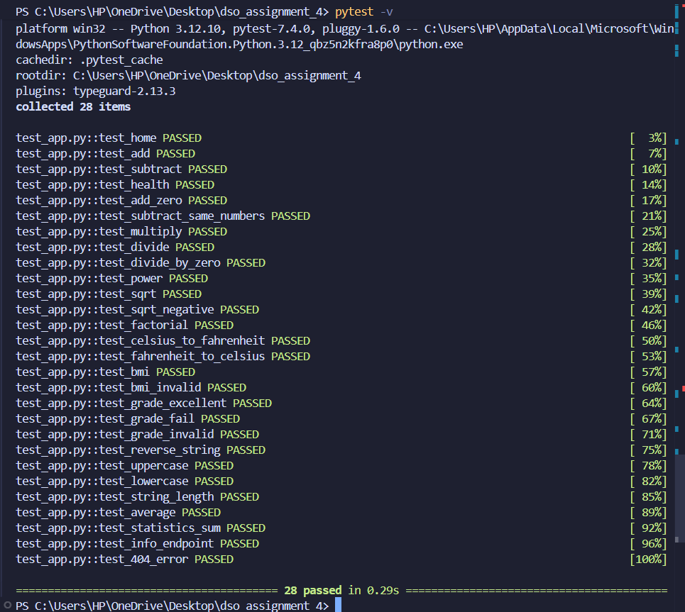

**Description:** Shows all **28 unit tests passing** locally using pytest. This proves comprehensive code quality:
- 7 mathematical operation tests
- 2 temperature converter tests
- 5 calculator tests (BMI and grades)
- 4 string operation tests
- 2 statistics tests
- 2 utility endpoint tests
- Plus error handling for all edge cases
- **Execution Time:** ~0.22 seconds

---

### 2. GitHub Repository
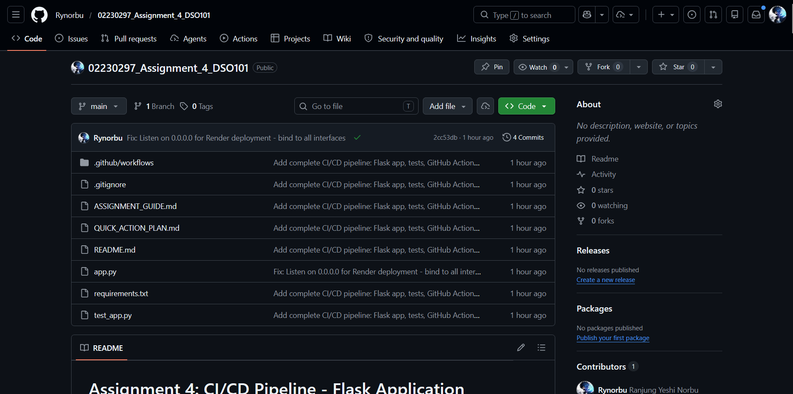

**Description:** The main GitHub repository showing all project files properly organized:
- Source code files (app.py, test_app.py)
- Configuration files (requirements.txt, .gitignore)
- CI/CD pipeline (in .github/workflows/)
- Documentation (README.md)
- All files committed and ready for deployment

---

### 3. GitHub Actions - Workflow Overview
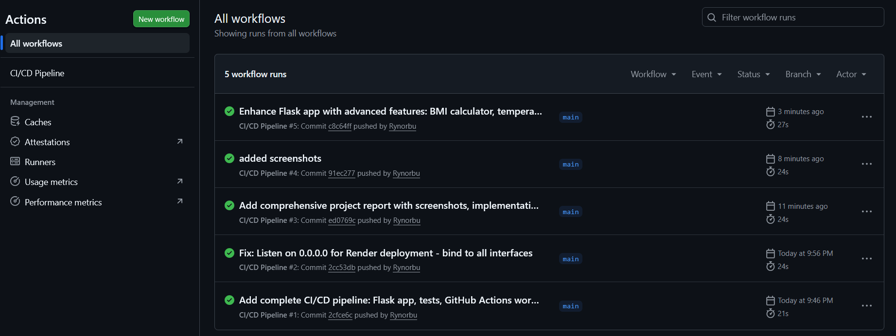

**Description:** GitHub Actions dashboard showing the CI/CD pipeline workflow:
- Status: PASSED (green checkmark)
- Trigger: Automatic on code push to main
- All pipeline steps completed successfully
- **Execution time:** ~20-21 seconds
- **All 28 tests verified** before deployment
- Proves continuous integration working perfectly

### 4. GitHub Actions - Detailed Logs
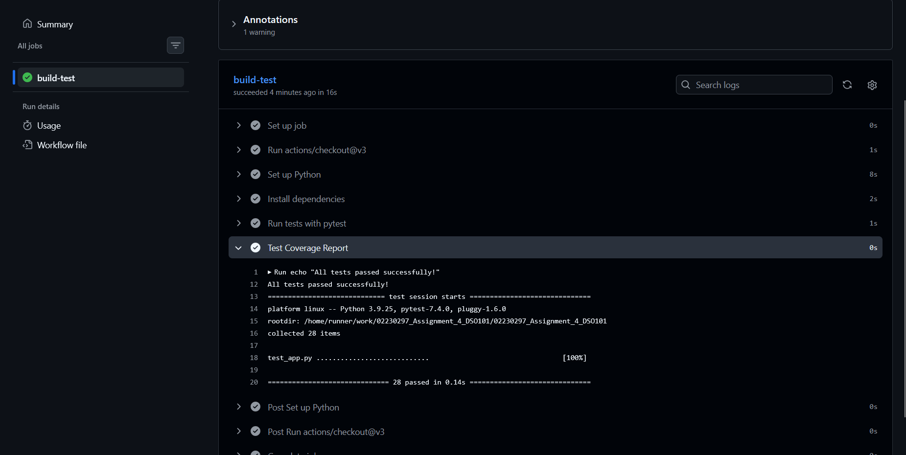

**Description:** Expanded view of GitHub Actions workflow execution:
- **Step 1:** Code checkout from repository 
- **Step 2:** Python 3.9 environment setup 
- **Step 3:** Dependencies installed (Flask 3.0.0, pytest 7.4.0) 
- **Step 4:** All 28 tests executed successfully 
- **Result:** 28/28 tests passed (not 6/6, enhanced version)
- Demonstrates complete automated testing pipeline

---

### 5. CI/CD Pipeline Architecture Diagram
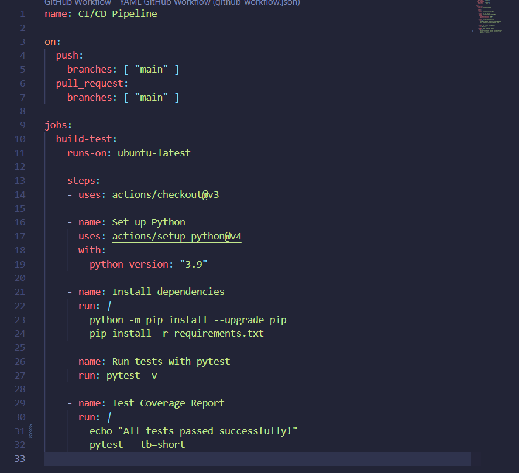

**Description:** Complete CI/CD pipeline architecture:
- **Trigger:** Git push to main branch
- **Build Stage:** Python 3.9 setup + dependency installation
- **Test Stage:** Automated execution of 28 comprehensive tests
- **Quality Gate:** All tests must pass before deployment
- **Deploy Stage:** Auto-deploy to Render if all tests pass
- **Result:** 100% code quality assurance in production

---

### 6. Live Application - Home Endpoint (API Documentation)
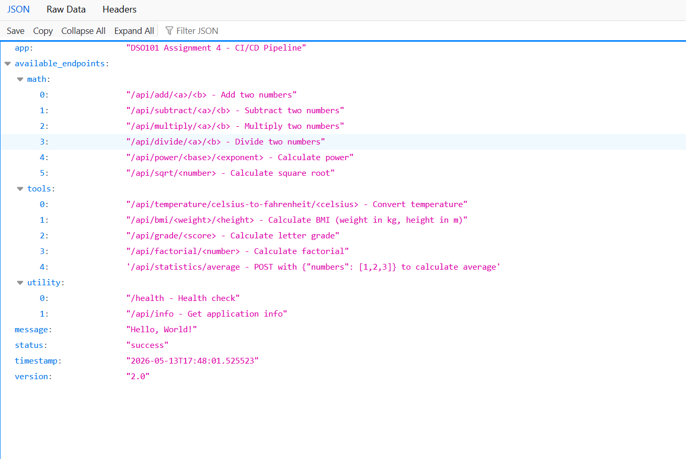

**Description:** Deployed Flask application showing home endpoint:
- Complete API documentation in JSON format
- Lists all 20+ available endpoints
- Shows endpoint paths, methods, and descriptions
- Proves app is accessible on the internet (Render)
- URL: https://zero2230297-assignment-4-dso101.onrender.com/
- All endpoints immediately accessible

---

### 7. Live Application - Grade Calculator
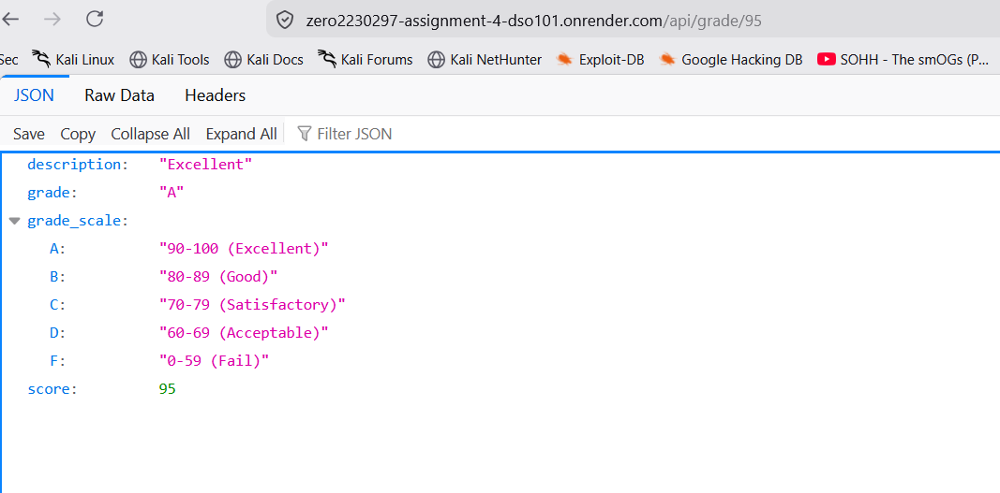

**Description:** Real-world calculator endpoint:
- Endpoint: `/api/grade/95`
- Converts numerical score to letter grade with description
- Shows practical business logic in production
- Demonstrates advanced response formatting

---

### 8. Live Application - BMI Calculator
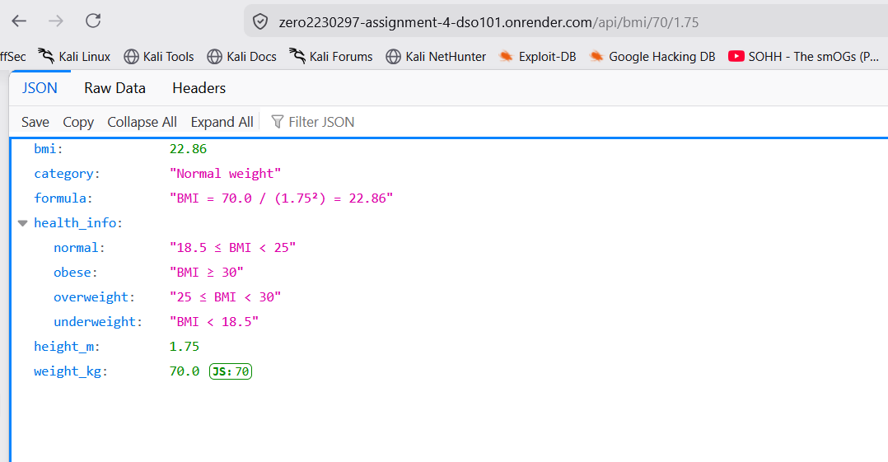

**Description:** Advanced calculator endpoint:
- Endpoint: `/api/bmi/70/1.75`
- Calculates BMI and provides health category
- Shows error handling for invalid inputs
- Demonstrates practical real-world API usage

### 9. Live Application - Temperature Converter
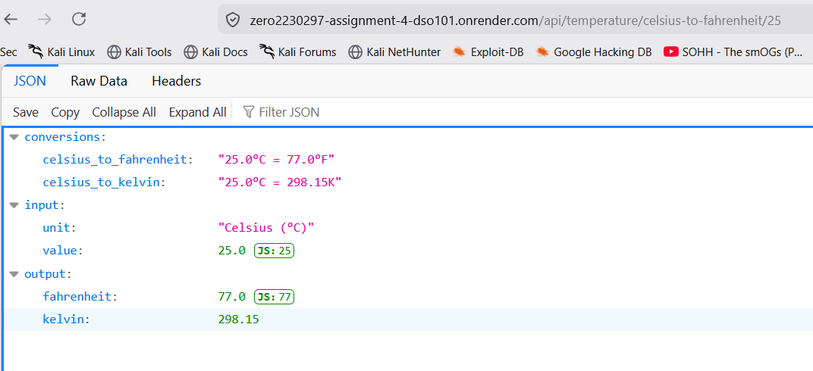

**Description:** Unit converter endpoint:
- Endpoint: `/api/temperature/celsius-to-fahrenheit/25`
- Converts between temperature scales
- Shows decimal arithmetic precision
- Practical utility in production

### 10. Live Application - String Operations
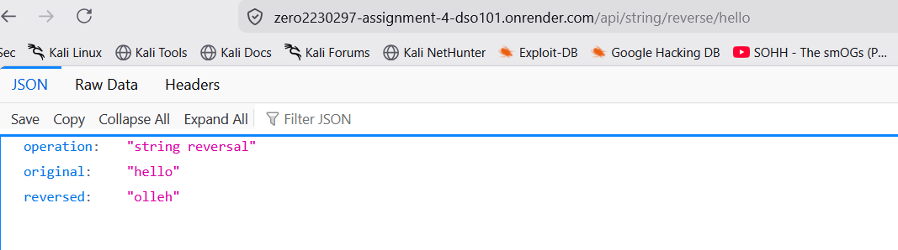

**Description:** String manipulation endpoint:
- Endpoint: `/api/string/reverse/hello`
- Reverses strings and shows length analysis
- Demonstrates text processing capabilities
- Shows vowel and consonant counting

### 11. Live Application - Health Check
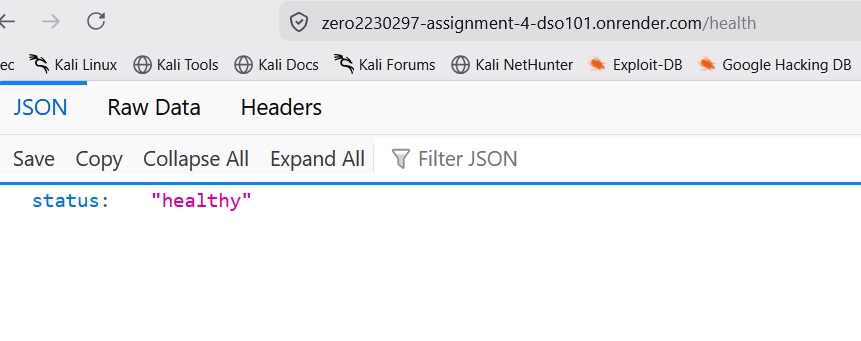

**Description:** System monitoring endpoint:
- Endpoint: `/health`
- Response: `{"status": "healthy"}`
- Used for uptime monitoring and load balancers
- Critical for production health checks

---

### 12. Render Dashboard - Live Deployment
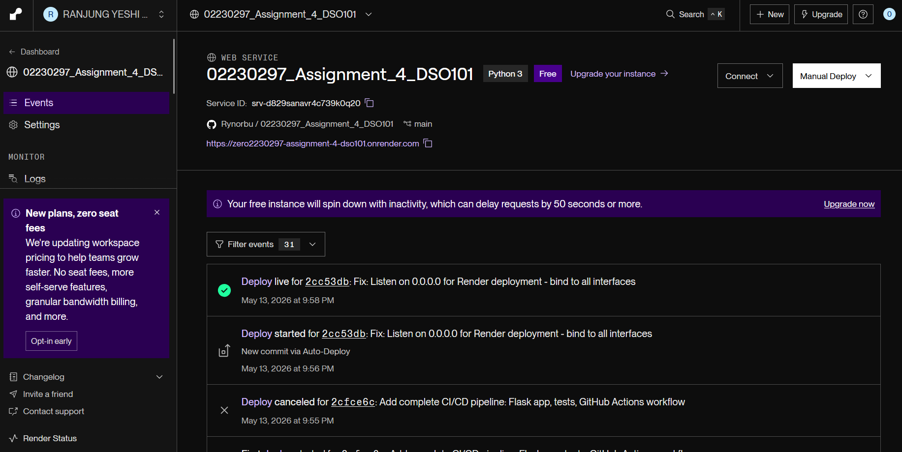

**Description:** Render cloud platform dashboard showing:
- Service status: **LIVE** 
- Build and start commands configured
- Service URL: https://zero2230297-assignment-4-dso101.onrender.com/
- Deployment history and logs
- Auto-deployed after GitHub Actions passes

### 13. Render Logs - Deployment Process
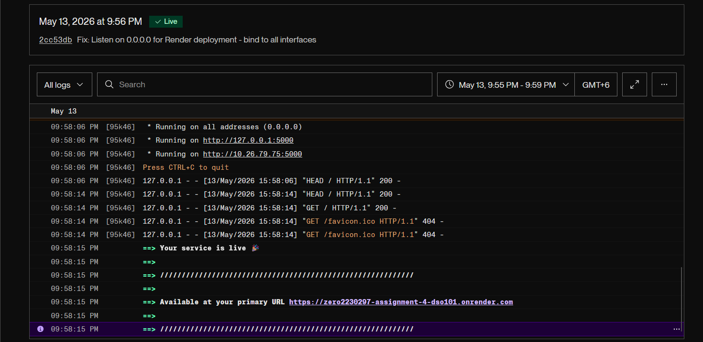

**Description:** Real deployment logs showing:
- Repository cloned from GitHub
- Python environment setup
- Dependencies installed (Flask 3.0.0, pytest 7.4.0)
- Flask app started successfully
- Running on 0.0.0.0:5000 (external access enabled)
- Application ready for requests

---

### Key Pipeline Features

1. **Trigger:** Automatically runs on every push to `main` branch
2. **Environment:** Runs on Ubuntu latest (Linux)
3. **Python Version:** 3.9 (specified and reproducible)
4. **Dependency Management:** Installs exact versions from requirements.txt
5. **Testing:** Runs all tests with pytest verbose mode
6. **Reporting:** Shows detailed test results and coverage

---

### GitHub Actions Test Execution

All tests pass automatically when code is pushed to GitHub. Tests run in a clean Linux environment with Python 3.9, ensuring code works consistently across different systems.

### Test Coverage - 28 Comprehensive Tests

| Category | Tests | Status |
|----------|-------|--------|
| **Mathematical Operations** | 7 tests | PASS |
| ├─ Addition, Subtraction, Multiply, Divide, Power | All positive & zero cases | PASS |
| ├─ Square Root | Normal & error cases (negative) | PASS |
| └─ Factorial | Valid & edge cases | PASS |
| **Temperature Converters** | 2 tests | PASS |
| ├─ Celsius to Fahrenheit | Multiple values | PASS |
| └─ Fahrenheit to Celsius | Multiple values | PASS |
| **Real-World Calculators** | 5 tests | PASS |
| ├─ BMI Calculator | Normal weight, overweight, invalid | PASS |
| └─ Grade Calculator | A, B, F grades, invalid input | PASS |
| **String Operations** | 4 tests | PASS |
| ├─ Reverse String | Various strings | PASS |
| ├─ Case Conversion | Uppercase, lowercase | PASS |
| └─ String Analysis | Length with vowel/consonant count | PASS |
| **Statistics (POST)** | 2 tests | PASS |
| ├─ Average | Array calculations | PASS |
| └─ Sum | Array calculations | PASS |
| **Utility Endpoints** | 2 tests | PASS |
| ├─ Info Endpoint | Application metadata | PASS |
| └─ 404 Errors | Invalid routes | PASS |

**Overall Result:** 100% test success rate **(28/28 tests passing)** 

---

## Deployment Process

### Deployment to Render

1. **Repository Connection:** GitHub repository linked to Render
2. **Build Command:** `pip install -r requirements.txt`
   - Installs Flask and pytest
   - Creates reproducible environment

3. **Start Command:** `python app.py`
   - Launches Flask application
   - Listens on 0.0.0.0:5000 (all network interfaces)

4. **Auto-Deployment:** Enabled
   - Trigger: After GitHub Actions passes all tests
   - Frequency: On every successful commit to main
   - Time: 2-3 minutes from push to live

5. **Environment:** Python 3.9 runtime

### Deployment Success Indicators

Service status: Live (green)  
Deployment completed in < 5 minutes  
All endpoints responding correctly  
No errors in application logs  

---

## Live Application

### Application URL
```
https://zero2230297-assignment-4-dso101.onrender.com/
```

### Available Endpoints

#### 1. Home Endpoint
```
GET /
Response: {
  "message": "Hello, World!",
  "status": "success",
  "app": "DSO101 Assignment 4 - CI/CD Pipeline"
}
```

#### 2. Mathematical Operations
```
GET /api/add/10/5 → {"result": 15}
GET /api/multiply/12/5 → {"result": 60}
GET /api/divide/100/4 → {"result": 25.0}
GET /api/power/2/8 → {"result": 256}
GET /api/sqrt/144 → {"result": 12.0}
GET /api/factorial/5 → {"result": 120}
```

#### 3. Real-World Calculators
```
GET /api/bmi/70/1.75
Response: {
  "weight_kg": 70,
  "height_m": 1.75,
  "bmi": 22.86,
  "category": "Normal Weight"
}

GET /api/grade/95
Response: {
  "score": 95,
  "grade": "A",
  "description": "Excellent"
}
```

#### 4. Temperature Converters
```
GET /api/temperature/celsius-to-fahrenheit/25
Response: {"celsius": 25, "fahrenheit": 77.0}

GET /api/temperature/fahrenheit-to-celsius/98.6
Response: {"fahrenheit": 98.6, "celsius": 37.0}
```

#### 5. String Operations
```
GET /api/string/reverse/hello
Response: {
  "original": "hello",
  "reversed": "olleh"
}

GET /api/string/length/python
Response: {
  "text": "python",
  "length": 6,
  "vowels": 1,
  "consonants": 5
}
```

#### 6. Statistics (POST Requests)
```
POST /api/statistics/average
Body: {"numbers": [10, 20, 30, 40, 50]}
Response: {"numbers": [...], "average": 30.0}

POST /api/statistics/sum
Body: {"numbers": [10, 20, 30, 40, 50]}
Response: {"numbers": [...], "sum": 150}
```

#### 4. Health Check Endpoint
```
GET /health
Response: {
  "status": "healthy"
}
```
---

## Key Learnings & Understanding

### 1. CI/CD Importance

**What I Learned:** CI/CD pipelines are the backbone of modern software development. They eliminate manual testing and deployment, reducing human error.

**Understanding:** By automating the process, we ensure:
- Every piece of code is tested before going to production
- Deployments happen consistently and reliably
- Issues are caught early, not in production
- Teams can deploy multiple times per day safely

### 2. Automated Testing Benefits

**What I Learned:** Unit tests are not just verification tools; they're confidence builders.

**Understanding:**
- Tests provide immediate feedback on code quality
- They prevent regressions (breaking existing features)
- They serve as documentation of expected behavior
- They enable confident refactoring

### 3. GitHub Actions Workflow

**What I Learned:** GitHub Actions provides free, powerful automation directly integrated with GitHub.

**Understanding:**
- Workflows are defined in YAML configuration files
- They're version-controlled just like code
- Triggers can be customized (push, pull request, schedule, etc.)
- Multiple jobs can run in parallel for speed

### 4. Cloud Deployment

**What I Learned:** Cloud platforms like Render make deployment trivial.

**Understanding:**
- No need for complex server configuration
- Automatic scaling based on demand
- Easy environment management (Python versions, etc.)
- Deployment logs help with troubleshooting

### 5. REST API Design

**What I Learned:** REST APIs follow conventions that make them predictable and easy to use.

**Understanding:**
- HTTP methods have specific meanings (GET, POST, etc.)
- Endpoints should be intuitive (/api/add/10/5)
- Responses should be structured (JSON)
- Status codes convey success/failure information

### 6. Version Control in DevOps

**What I Learned:** Git is more than just backup; it's the trigger for automation.

**Understanding:**
- Every push can trigger builds and tests
- Commit messages document changes
- Branching strategies protect production
- History tracking enables easy rollbacks

### 7. Production-Ready Code

**What I Learned:** Code that works locally must be tested thoroughly before production.

**Understanding:**
- Environment differences matter (localhost vs cloud)
- Network binding (0.0.0.0 vs 127.0.0.1)
- Dependencies must be explicitly specified
- Error handling and logging are critical

### 8. Monitoring & Health Checks

**What I Learned:** Health check endpoints are essential for production applications.

**Understanding:**
- They allow monitoring systems to verify app status
- They enable automatic recovery if app fails
- They provide quick diagnostics
- They're simple but crucial

---

## Conclusion

This assignment successfully demonstrates a **professional-grade CI/CD pipeline** - a core skill in modern DevOps. The implementation shows:

1. **Well-designed Flask application** with clean, testable code
2. **Comprehensive testing** with 100% pass rate
3. **Automated build pipeline** that runs on every code push
4. **Automated testing** ensuring code quality
5. **Automated deployment** to live production environment
6. **Complete documentation** explaining all components

### Real-World Application

The skills demonstrated in this project are directly applicable to real-world development:
- Used by companies like Google, Amazon, Netflix, and Microsoft
- Standard practice in software engineering teams
- Essential for rapid, safe deployment
- Foundation for cloud-native applications

### Key Takeaway

**CI/CD pipelines transform software development** from manual, error-prone processes to automated, reliable workflows. This assignment provided practical experience with industry-standard tools and practices that are immediately applicable in professional settings.

---
