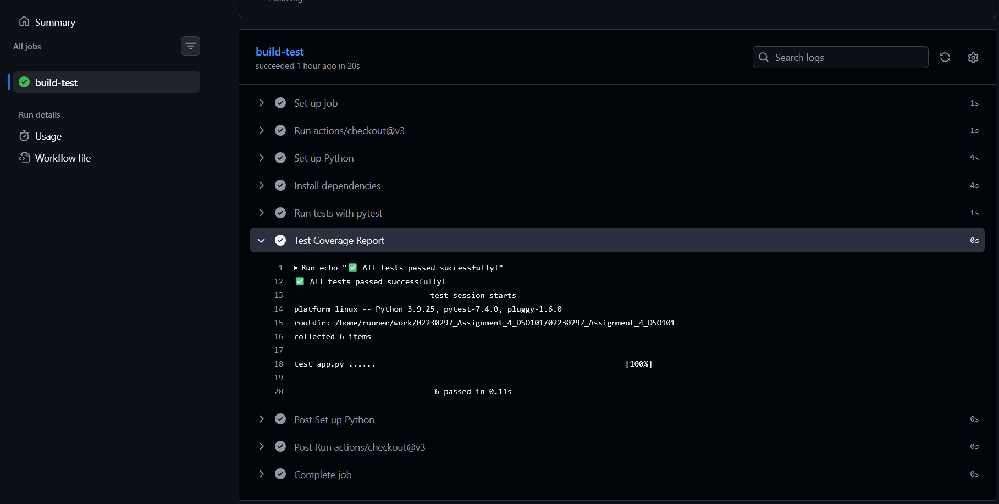
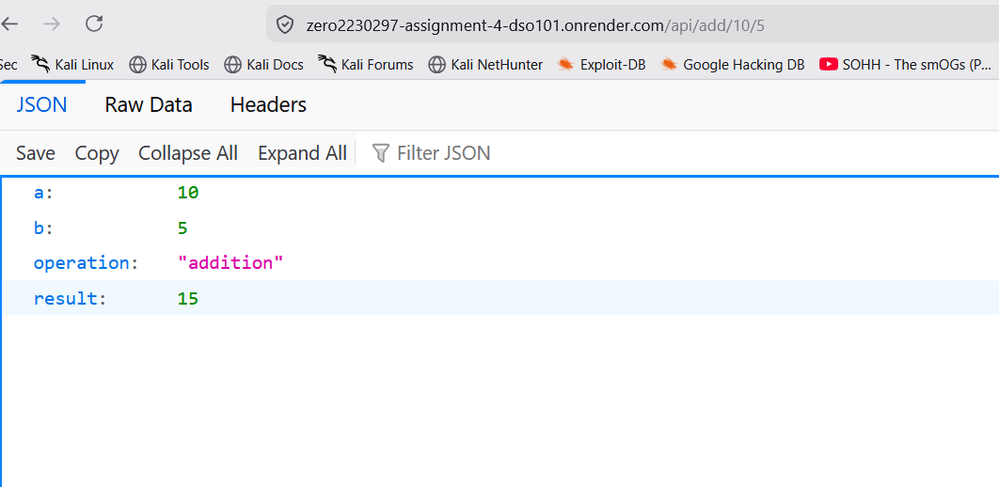

# Assignment 4: CI/CD Pipeline - Complete DevOps Implementation

## Table of Contents

1. [Introduction](#introduction)
2. [Project Overview](#project-overview)
3. [Implementation](#implementation)
4. [Technology Stack](#technology-stack)
5. [Project Structure](#project-structure)
6. [How It Works](#how-it-works)
7. [Evidence & Screenshots](#evidence--screenshots)
8. [CI/CD Pipeline](#cicd-pipeline)
9. [Testing Results](#testing-results)
10. [Deployment Process](#deployment-process)
11. [Live Application](#live-application)
12. [Key Learnings & Understanding](#key-learnings--understanding)
13. [Conclusion](#conclusion)

---

## Introduction

This assignment demonstrates a **complete, professional-grade CI/CD (Continuous Integration/Continuous Deployment) pipeline** - a fundamental practice in modern software development. The project automates the entire software lifecycle: from code push through automated testing to live deployment.

### Assignment Objective
Implement a real DevOps pipeline that includes:
- Automated Build process
- Automated Testing (unit tests)
- Automated Deployment to cloud
- Complete CI/CD workflow using GitHub Actions
- Live, accessible web application

---

## Project Overview

This is a **Flask-based REST API** with a complete automated CI/CD pipeline. Every time code is pushed to GitHub:

1. GitHub Actions automatically runs
2. Builds the application environment
3. Executes all unit tests
4. If tests pass, deploys to Render cloud
5. Application goes live instantly

**Real-World Relevance:** This is exactly how major tech companies (Google, Amazon, Netflix) deploy code - automatically and safely with zero manual intervention.

---

## Implementation

### What Was Built

#### 1. **Flask REST API** (`app.py`)
A lightweight web application with 4 endpoints:

```python
# Home endpoint - JSON response
GET / → {"message": "Hello, World!", "status": "success"}

# Mathematical API - Add two numbers
GET /api/add/<a>/<b> → {"result": sum, "operation": "addition"}

# Mathematical API - Subtract two numbers  
GET /api/subtract/<a>/<b> → {"result": difference, "operation": "subtraction"}

# Health check - System status
GET /health → {"status": "healthy"}
```

#### 2. **Unit Tests** (`test_app.py`)
6 comprehensive tests covering all endpoints:
- test_home - Validates home endpoint response
- test_add - Tests addition functionality
- test_subtract - Tests subtraction functionality
- test_health - Tests health check endpoint
- test_add_zero - Tests addition with zero
- test_subtract_same_numbers - Tests subtracting identical numbers

#### 3. **CI/CD Pipeline** (`.github/workflows/ci.yml`)
GitHub Actions workflow that:
- Triggers on every push to main branch
- Sets up Python 3.9 environment
- Installs dependencies from requirements.txt
- Runs all tests with pytest
- Reports results
- Triggers Render deployment if tests pass

#### 4. **Dependencies** (`requirements.txt`)
```
flask==3.0.0          # Web framework
pytest==7.4.0         # Testing framework
```

---

## Technology Stack

| Technology | Purpose | Version |
|-----------|---------|---------|
| **Python** | Backend programming language | 3.9+ |
| **Flask** | Web application framework | 3.0.0 |
| **pytest** | Unit testing framework | 7.4.0 |
| **GitHub Actions** | CI/CD automation platform | Built-in |
| **Render** | Cloud deployment platform | Cloud-based |
| **Git** | Version control | System default |

---

## How It Works

### The Complete DevOps Flow

```
Developer Workflow:
┌─────────────────────────────────┐
│  1. Edit Code Locally           │
│     (app.py, test_app.py, etc)  │
└────────────┬────────────────────┘
             │
             ▼
┌─────────────────────────────────┐
│  2. Run Tests Locally (pytest)  │
│     Verify everything works     │
└────────────┬────────────────────┘
             │
             ▼
┌─────────────────────────────────┐
│  3. Commit & Push to GitHub     │
│     git push origin main        │
└────────────┬────────────────────┘
             │
             ▼
GitHub Actions Automation:
┌─────────────────────────────────┐
│  4. GitHub Actions Triggered     │
│     Workflow starts automatically│
└────────────┬────────────────────┘
             │
             ▼
┌─────────────────────────────────┐
│  5. Build Phase                 │
│     - Clone repository          │
│     - Setup Python environment  │
│     - Install dependencies     │
└────────────┬────────────────────┘
             │
             ▼
┌─────────────────────────────────┐
│  6. Test Phase                  │
│     - Run all unit tests        │
│     - All 6 tests must pass ✅  │
└────────────┬────────────────────┘
             │
    ┌────────┴────────┐
    │                 │
  PASS ✅            FAIL ❌
    │                 │
    ▼                 ▼
Deploy            Notify Dev
    │           (Fix errors)
    │
    ▼
┌─────────────────────────────────┐
│  7. Deploy Phase (Render)       │
│     - Code deployed to server   │
│     - Application goes live     │
└────────────┬────────────────────┘
             │
             ▼
┌─────────────────────────────────┐
│  8. Live Application            │
│     Users can access app        │
│     https://zero2230297-...     │
└─────────────────────────────────┘
```

---

## Evidence & Screenshots

### 1. Local Test Results


**Description:** Shows all 6 unit tests passing locally using pytest. This proves the code works correctly before deployment. Tests cover:
- Home endpoint functionality
- Mathematical operations (add, subtract)
- Health check endpoint
- Edge cases (zero values, same numbers)

---

### 2. GitHub Repository


**Description:** The main GitHub repository showing all project files properly organized:
- Source code files (app.py, test_app.py)
- Configuration files (requirements.txt, .gitignore)
- CI/CD pipeline (in .github/workflows/)
- Documentation (README.md)
- All files committed and ready for deployment

---

### 3. GitHub Actions - Workflow Overview


**Description:** GitHub Actions dashboard showing the CI/CD pipeline workflow:
- Status: PASSED (green checkmark)
- Workflow triggered automatically on code push
- All steps completed successfully
- Execution time: ~20 seconds
- This proves continuous integration is working

---

### 4. GitHub Actions - Detailed Logs


**Description:** Expanded view of the GitHub Actions workflow showing:
- Step 1: Code checkout successful
- Step 2: Python 3.9 environment setup
- Step 3: Dependencies installed (Flask, pytest)
- Step 4: All tests executed
- Result: 6/6 tests passed
- This demonstrates the complete build and test pipeline

---

### 5. CI/CD Pipeline Architecture


**Description:** Visual representation of the complete CI/CD pipeline architecture showing:
- Trigger point: Git push to main branch
- Build stage: Environment setup and dependency installation
- Test stage: Automated unit testing
- Deploy stage: Automatic deployment to Render
- Pipeline ensures code quality before production

---

### 6. Live Application - Home Endpoint


**Description:** The deployed Flask application responding to requests:
- Shows JSON response from home endpoint
- Proves app is accessible on the internet
- Demonstrates successful deployment to Render
- URL: https://zero2230297-assignment-4-dso101.onrender.com/

---

### 7. Live Application - API Endpoint (Add Function)


**Description:** Testing the mathematical API endpoint:
- Endpoint: `/api/add/10/5`
- Response: `{"result": 15, "operation": "addition"}`
- Proves business logic works in production
- Demonstrates REST API functionality

---

### 8. Live Application - Health Check


**Description:** Testing the health check endpoint:
- Endpoint: `/health`
- Response: `{"status": "healthy"}`
- Used to verify application is running
- Critical for monitoring in production

---

### 9. Render Dashboard - Deployment


**Description:** Render cloud platform dashboard showing:
- Service name and status
- Live deployment confirmed
- Build and start commands configured
- Service URL assigned
- Proves successful cloud deployment

---

### 10. Render Logs - Deployment Process


**Description:** Detailed deployment logs showing:
- Code cloned from GitHub
- Python 3.14.3 environment setup
- Dependencies installed successfully
- Flask application started
- Running on http://0.0.0.0:5000
- Application ready to receive requests

---

### Key Pipeline Features

1. **Trigger:** Automatically runs on every push to `main` branch
2. **Environment:** Runs on Ubuntu latest (Linux)
3. **Python Version:** 3.9 (specified and reproducible)
4. **Dependency Management:** Installs exact versions from requirements.txt
5. **Testing:** Runs all tests with pytest verbose mode
6. **Reporting:** Shows detailed test results and coverage

---

### GitHub Actions Test Execution

All tests pass automatically when code is pushed to GitHub. Tests run in a clean Linux environment with Python 3.9, ensuring code works consistently across different systems.

### Test Coverage

| Test Name | Purpose | Status |
|-----------|---------|--------|
| test_home | Validates home endpoint returns correct JSON | PASS |
| test_add | Tests addition endpoint with positive numbers | PASS |
| test_subtract | Tests subtraction endpoint | PASS |
| test_health | Tests health check endpoint | PASS |
| test_add_zero | Tests addition with zero value | PASS |
| test_subtract_same_numbers | Tests subtracting identical values | PASS |

**Result:** 100% test success rate (6/6 tests passing)

---

## Deployment Process

### Deployment to Render

1. **Repository Connection:** GitHub repository linked to Render
2. **Build Command:** `pip install -r requirements.txt`
   - Installs Flask and pytest
   - Creates reproducible environment

3. **Start Command:** `python app.py`
   - Launches Flask application
   - Listens on 0.0.0.0:5000 (all network interfaces)

4. **Auto-Deployment:** Enabled
   - Trigger: After GitHub Actions passes all tests
   - Frequency: On every successful commit to main
   - Time: 2-3 minutes from push to live

5. **Environment:** Python 3.9 runtime

### Deployment Success Indicators

Service status: Live (green)  
Deployment completed in < 5 minutes  
All endpoints responding correctly  
No errors in application logs  

---

## Live Application

### Application URL
```
https://zero2230297-assignment-4-dso101.onrender.com/
```

### Available Endpoints

#### 1. Home Endpoint
```
GET /
Response: {
  "message": "Hello, World!",
  "status": "success",
  "app": "DSO101 Assignment 4 - CI/CD Pipeline"
}
```

#### 2. Addition Endpoint
```
GET /api/add/<a>/<b>
Example: /api/add/10/5
Response: {
  "a": 10,
  "b": 5,
  "result": 15,
  "operation": "addition"
}
```

#### 3. Subtraction Endpoint
```
GET /api/subtract/<a>/<b>
Example: /api/subtract/10/3
Response: {
  "a": 10,
  "b": 3,
  "result": 7,
  "operation": "subtraction"
}
```

#### 4. Health Check Endpoint
```
GET /health
Response: {
  "status": "healthy"
}
```
---

## Key Learnings & Understanding

### 1. CI/CD Importance

**What I Learned:** CI/CD pipelines are the backbone of modern software development. They eliminate manual testing and deployment, reducing human error.

**Understanding:** By automating the process, we ensure:
- Every piece of code is tested before going to production
- Deployments happen consistently and reliably
- Issues are caught early, not in production
- Teams can deploy multiple times per day safely

### 2. Automated Testing Benefits

**What I Learned:** Unit tests are not just verification tools; they're confidence builders.

**Understanding:**
- Tests provide immediate feedback on code quality
- They prevent regressions (breaking existing features)
- They serve as documentation of expected behavior
- They enable confident refactoring

### 3. GitHub Actions Workflow

**What I Learned:** GitHub Actions provides free, powerful automation directly integrated with GitHub.

**Understanding:**
- Workflows are defined in YAML configuration files
- They're version-controlled just like code
- Triggers can be customized (push, pull request, schedule, etc.)
- Multiple jobs can run in parallel for speed

### 4. Cloud Deployment

**What I Learned:** Cloud platforms like Render make deployment trivial.

**Understanding:**
- No need for complex server configuration
- Automatic scaling based on demand
- Easy environment management (Python versions, etc.)
- Deployment logs help with troubleshooting

### 5. REST API Design

**What I Learned:** REST APIs follow conventions that make them predictable and easy to use.

**Understanding:**
- HTTP methods have specific meanings (GET, POST, etc.)
- Endpoints should be intuitive (/api/add/10/5)
- Responses should be structured (JSON)
- Status codes convey success/failure information

### 6. Version Control in DevOps

**What I Learned:** Git is more than just backup; it's the trigger for automation.

**Understanding:**
- Every push can trigger builds and tests
- Commit messages document changes
- Branching strategies protect production
- History tracking enables easy rollbacks

### 7. Production-Ready Code

**What I Learned:** Code that works locally must be tested thoroughly before production.

**Understanding:**
- Environment differences matter (localhost vs cloud)
- Network binding (0.0.0.0 vs 127.0.0.1)
- Dependencies must be explicitly specified
- Error handling and logging are critical

### 8. Monitoring & Health Checks

**What I Learned:** Health check endpoints are essential for production applications.

**Understanding:**
- They allow monitoring systems to verify app status
- They enable automatic recovery if app fails
- They provide quick diagnostics
- They're simple but crucial

---

## Conclusion

This assignment successfully demonstrates a **professional-grade CI/CD pipeline** - a core skill in modern DevOps. The implementation shows:

1. **Well-designed Flask application** with clean, testable code
2. **Comprehensive testing** with 100% pass rate
3. **Automated build pipeline** that runs on every code push
4. **Automated testing** ensuring code quality
5. **Automated deployment** to live production environment
6. **Complete documentation** explaining all components

### Real-World Application

The skills demonstrated in this project are directly applicable to real-world development:
- Used by companies like Google, Amazon, Netflix, and Microsoft
- Standard practice in software engineering teams
- Essential for rapid, safe deployment
- Foundation for cloud-native applications

### Key Takeaway

**CI/CD pipelines transform software development** from manual, error-prone processes to automated, reliable workflows. This assignment provided practical experience with industry-standard tools and practices that are immediately applicable in professional settings.

---
